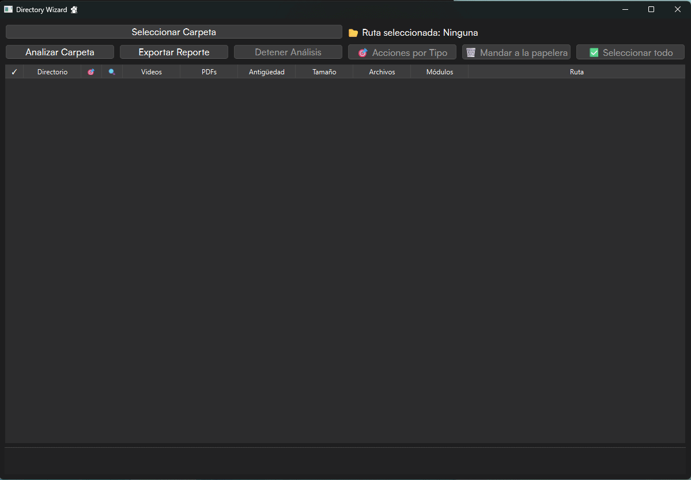
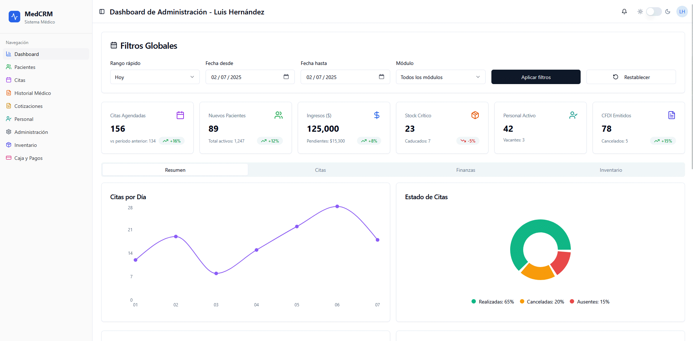
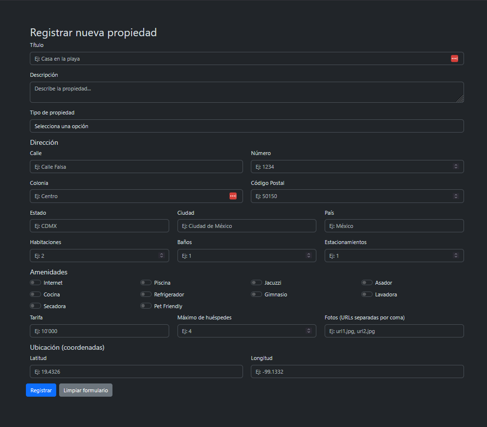

  

👋 ¡Hola, soy Isaac Manríquez!

🏗️ Arquitecto de Software

Diseño como si fuera arte. Código como si fuera magia. Documentación... como si me pagaran.

<!-- Badges sociales / stats -->

  
  
  
  

  
  
  
  

## 🚀 Proyectos destacados

<table>
  <tr>
    <td align="center">
      <b>🧙‍♂️ Director Wizard</b> 
      
    </td>
    <td align="center">
      <b>🏥 CRM Med</b> 
      
    </td>
    <td align="center">
      <b>🏘️ Sistema de Reservas</b> 
      
    </td>
  </tr>
  <tr>
    <td align="center">
      <i>App de escritorio para optimizar, limpiar y organizar carpetas en Windows.</i>
    </td>
    <td align="center">
      <i>Sistema modular fullStack para doctores y clínicas con control de pacientes, pagos y más.</i>
    </td>
    <td align="center">
      <i>App web fullStack tipo Airbnb creada como práctica colaborativa en Dev.f.</i>
    </td>
  </tr>
  <tr>
    <td align="center">
      <b>Tecnologías:</b> 
      
      
      
    </td>
    <td align="center">
      <b>Tecnologías:</b> 
      
      
      
      
    </td>
    <td align="center">
      <b>Tecnologías:</b> 
      
      
      
      
      
    </td>
  </tr>
</table>

---

## 📈 Estadísticas de GitHub

  
  

## 🧰 Herramientas que uso

  
  
  
  

## 💡 Ruta de aprendizaje y recursos

- [Roadmap de Programación](https://retosdeprogramacion.com/roadmap)
- [Curso Python desde cero](https://github.com/mouredev/hello-python)
- [Curso JavaScript desde cero](https://github.com/mouredev/hello-javascript)
- [Curso Git & GitHub](https://github.com/mouredev/hello-git)

## ☕ Apóyame

  
  

> "El software bien hecho es invisible, pero su impacto es inolvidable."

🧠 Sobre mí

Apasionado por diseñar soluciones funcionales, limpias y escalables.  
Me gusta crear herramientas que mejoren la vida de las personas y automatizar lo que se pueda automatizar.

- 🔭 Actualmente trabajando en: **CRM Med** y **Directorio Wizard**
- 🧪 Explorando: Automatización con Python y herramientas de IA
- 🎯 Enfoque principal: Backend, Fullstack y Arquitectura
- 📍 Localizado en: México 🇲🇽

## ⚒️ Habilidades técnicas

<table>
  <tr>
    <th>Lenguajes & Scripting</th>
    <th>Frameworks & Tools</th>
    <th>Diseño & Contenido</th>
  </tr>
  <tr>
    <td align="center">
        
        
        
        
      
    </td>
    <td align="center">
        
        
        
        
      
    </td>
    <td align="center">
        
        
      
    </td>
  </tr>
  <tr>
    <th colspan="3">Actualmente explorando</th>
  </tr>
  <tr>
    <td colspan="3" align="center">
      
      
      
    </td>
  </tr>
</table>

🧰 Herramientas que uso

     

📬 Contacto

    

